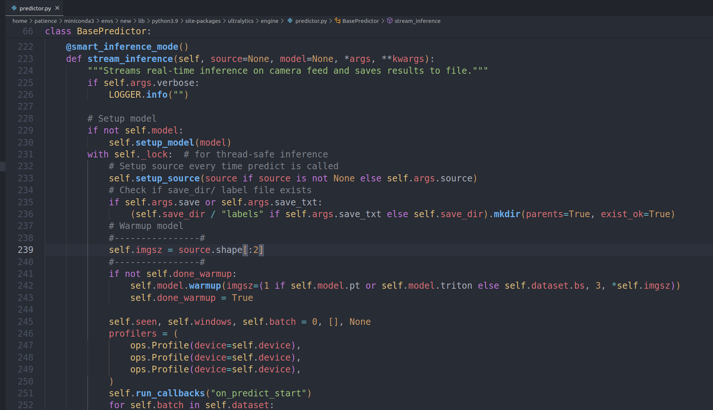

# 智能救援视觉代码
---

### Ultralytics 源码修改


### Python 环境配置
- 安装 miniconda
- 创建并激活虚拟环境
``` bash
conda create --name new python=3.9
conda activate new
```

- 安装 pip
- 安装所需库
```bash
pip install ultralytics opencv-python numpy torch torchvision matplotlib pyserial ncnn
```


### 使用说明
- arrange.py 按距离排序
- compute.py 通过地面棋盘格照片计算单应性矩阵，可以鼠标交互
- config.py 储存配置信息
- infer.py 推理模型并处理
- main.py 主程序，双线程
- message.py 读写串口
- reflection.py 通过单应性矩阵，直接从像素坐标系转换至世界坐标系
- target.py 目标类，包含坐标以及距离
